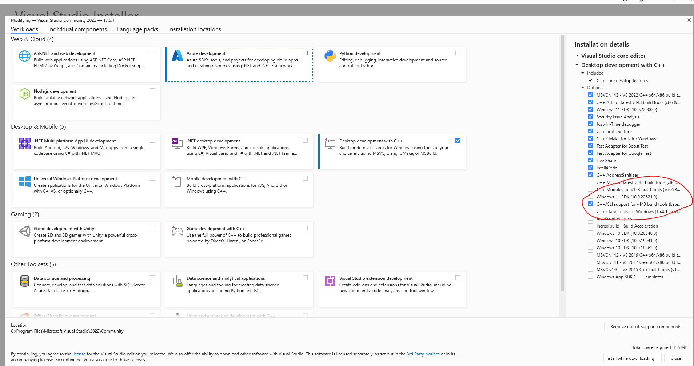

# Flutter Firebase Windows Project

This guide explains how to set up a new Flutter project with Firebase on Windows, including the setup for C++ projects.

## Prerequisites

Before you begin, ensure you have the following installed:
- [Flutter SDK](https://flutter.dev/docs/get-started/install/windows)
- [Firebase CLI](https://firebase.google.com/docs/cli#install_the_firebase_cli)
- [Git](https://git-scm.com/downloads)
- [Visual Studio Build Tools](https://visualstudio.microsoft.com/visual-cpp-build-tools/)
    - Note: This is different from Visual Studio Code (VS Code). The Build Tools are required for Windows development with Flutter.

## Installation

1. Install Visual Studio Build Tools:
    - Download the installer from the [official Microsoft website](https://visualstudio.microsoft.com/visual-cpp-build-tools/).
    - Run the installer and select "Desktop development with C++".
    - In the installation details, make sure "[C++/CLI support for v143 build tools (Latest)](https://github.com/firebase/flutterfire/issues/10992#issuecomment-1642114503)" is checked.
      


   *Figure 1: Visual Studio Build Tools installation with "C++/CLI support for v143 build tools (Latest)" option highlighted*
   
 - Complete the installation process.


## Firebase Configuration

Follow these steps to set up Firebase for your Flutter project:

1. Install the required command line tools:
    - Install the Firebase CLI by following the instructions [here](https://firebase.google.com/docs/cli#install_the_firebase_cli).
    - Install the FlutterFire CLI:
      ```
      dart pub global activate flutterfire_cli
      ```
    - Add the FlutterFire CLI to your system's PATH:
        - Locate the path where `flutterfire.bat` is installed (typically in your user's AppData folder).
        - Add this path to your Windows environment variables.
    - Additional resources for FlutterFire setup:
      - [FlutterFire Overview](https://firebase.flutter.dev/docs/overview)
      - [Flutter for Desktop: Using Firebase on Windows](https://iteo.medium.com/flutter-for-desktop-using-firebase-on-windows-9e3135b9ebd)

2. Configure Firebase:
    - Create a new Firebase project in the [Firebase Console](https://console.firebase.google.com/).
    - Run the following command in your project directory:
      ```
      flutterfire configure
      ```
    - Follow the prompts to select your Firebase project and platforms.
    - Note: The `firebase_options.dart` file will be generated automatically by the `flutterfire configure` command.

3. Initialize Firebase in your app:
    - Open your `lib/main.dart` file and add the following imports:
      ```dart
      import 'package:firebase_core/firebase_core.dart';
      import 'firebase_options.dart';
      ```
      - Modify your `main()` function to initialize Firebase:
        ```dart
        void main() async {
          WidgetsFlutterBinding.ensureInitialized();
          await Firebase.initializeApp(
            options: DefaultFirebaseOptions.currentPlatform,
          );
          runApp(MyApp());
        }
        ```

          - Note: Currently, Windows supports the following Firebase plugins:
            - firebase_auth     .
            - cloud_firestore  .
            - firebase_storage.
          
          For the most up-to-date list of available plugins and their compatibility with different platforms, please refer to the [official Firebase documentation on available plugins](https://firebase.google.com/docs/flutter/setup?platform=android#available-plugins).
      
4. Add Firebase to your C++ project:

   Note: To add Firebase to Windows, it must be added to Android/iOS first.

   a. Configure a Firebase project with an app:
    - Follow the instructions to [create a Firebase project](https://firebase.google.com/docs/cpp/setup?platform=android#create-firebase-project).

   b. Register your app with Firebase:
    - Follow the steps to [register your app](https://firebase.google.com/docs/cpp/setup?platform=android#register-app) in the Firebase console.

   c. Add the Firebase configuration file:
    - [Add the configuration file](https://firebase.google.com/docs/cpp/setup?platform=android#add-config-file) to your project as instructed in the Firebase documentation.

   d. For Android: Add Firebase C++ SDKs:
    - Follow the instructions to [add the Firebase C++ SDKs](https://firebase.google.com/docs/cpp/setup?platform=android#add-sdks) to your Android project.

   e. Set up a desktop workflow (beta):
    - Follow the [desktop workflow setup instructions](https://firebase.google.com/docs/cpp/setup?platform=android#desktop-workflow) in the Firebase documentation.

   f. Available libraries for desktop:
    - Refer to the [list of available libraries for desktop](https://firebase.google.com/docs/cpp/setup?platform=android#libraries-desktop) in the Firebase documentation.

## Running the App

To run the app on Windows:

1. Ensure you have a Windows desktop environment set up for Flutter:
   ```
   flutter config --enable-windows-desktop
   ```    
   ```
   flutter create --platforms=windows .
   ```    
2. Build Windows:
   ```
    flutter build windows -v
   ```    
3. Run the app:
   ```
   flutter run -d windows
   ```

## Troubleshooting

If you encounter any issues, please check the following:

- Ensure all prerequisites are correctly installed.
- For Visual Studio Build Tools:
    - Verify that "Desktop development with C++" is selected.
    - Confirm that "C++/CLI support for v143 build tools (Latest)" is installed.
- Verify that the FlutterFire CLI is correctly installed and added to your PATH.
- Make sure you've run `flutterfire configure` and selected the correct Firebase project.
- Check that Firebase is properly initialized in your `main.dart` file.
- Ensure you're only using the supported Firebase plugins for Windows.

For more detailed information, refer to the [Flutter documentation](https://flutter.dev/docs) and [Firebase documentation](https://firebase.google.com/docs/flutter/setup).

For C++ specific issues, refer to the [Firebase C++ documentation](https://firebase.google.com/docs/cpp).

## Contributing

Contributions are welcome! Please feel free to submit a Pull Request.
